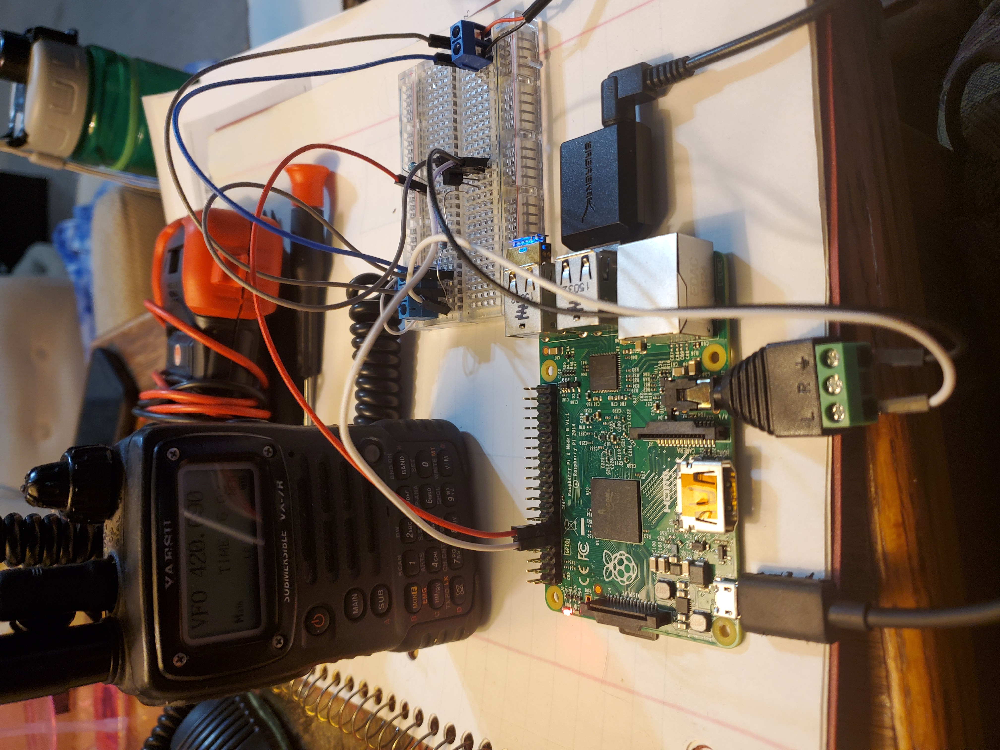
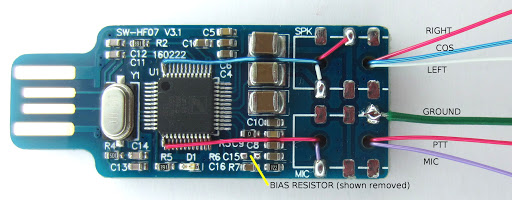

# Hambone


<br>
<em>Hambone (Noun): Ham + Bot + Tone</em>

## About
Hambone is a Ham Radio Bot built for the Raspberry Pi. It acts as computer interface for your radio by listening for DTMF commands and can activate the radio's PTT via the RPI's GPIO to play audio. Think of this as an IRC bot but with a radio! 

This project was the result of an experiment I had seeing if my handheld could work as a POCSAG transmitter. It didn’t work because the VX-7R doesn't support transmitting data at 9600 baud. More or less it took the 2FSK coming from the audio source and modulated it as NFM. Not to throw away a mostly working product I re-purposed my failed experiment so it can be something fun like a fake number station or read the weather.

This program was written for the RPi and Yaesu VX-7R in mind however the core functionality should work for other applications. Mileage may vary if you use other platforms.

## Required Software
```
$ sudo apt update
$ sudo apt install python3-numpy mpg123 cw espeak-ng python3-pip portaudio19-dev
$ pip3 install pyaudio scipy gTTS pyowm==2.10.0
```

## Enable NTP Time and Change Time Zone
```
$ sudo timedatectl set-ntp True
$ sudo raspi-config 

(raspi-config): Localisation Options --> Change Time Zone
```

## ENV Class
Envirement variables shuch as callsign need to be present before you start the program. Copy env_example.py to env.py and fill in the required information. 
```
$ cp env_example.py env.py
$ nano env.py
```

## Run Program 
```
sudo python3.X main.py
```

## DTMF Commands
```
+----------------------------+
|   MODULE  |       PIN      |
+----------------------------+
| TEST     -->   123         |
| PARROT   -->   3246 (#ECHO)|
| AUDIO Ex -->   054         |
| DATE     -->   3283 (#DATE)|
| TIME     -->   8463 (#TIME)|
| WEATHER  -->   99   (#WX)  |
| NUMBERS  -->   ###         |
| CLR PIN  -->   *#          |  
+----------------------------+
```

## Theory Of Operation
When the program starts, there is a listening loop in main that takes 0.4sec samples (RX class) of the received audio and then decodes it to see what DTMF tones (DTMF class) are present. If there is a valid DTMF tone it returns a char and it gets concatenated to the “pin” variable.

This “pin” variable is then sent to the select() function found in the ModuleController class. If the pin is valid, the select() function will run the linked Module and then return True. If select() returns True or if the length of the pin is greater then 6, the pin variable will reset to "". If the pin is invalid, the ModuleController.select() returns False and the listening loop in main will continue until one of the other two conditions return True. 

This application runs synchronously meaning that each task must complete before beginning the next. Classes found in the util/ folder handle audio in, DTMF decoding, gpio manipulation, and playing audio. Classes found in the modules/ folder handle each individual function called by the ModuleController. Module classes are responsible for activating the radio’s PTT using the TX class.  

Global variables such as API keys and the user’s callsign is stored in the ENV class. There is a .gitignore file preventing env.py from being uploaded to the repo so if there's any variables added to env.py, env_example.py should be updated as well.

## Directory Tree
```
rpi_vx-7r
 ├── log/                   ## Application Logs
 │    └── event.log
 │
 ├── extra/                 ## Documentation, Scripts, Etc
 │    └── pyaudioHelper.py  ## PyAudio Helper script, finds the mic index
 │
 ├── wav/                   ## Audio Files
 ├── util/                  ## Application Util Classes
 │    ├── Voice.py          ## Uses Google TTS or espeak to create audio
 │    ├── TX.py             ## Handles GPIO Pin
 │    ├── RX.py             ## Audio Sampling
 │    ├── DTMF.py           ## DTMF Decoding
 │    └── Callsign.py       ## Uses Voice Or cw to play user's callsign
 │
 ├── modules/               ## Modules
 │    ├── Module.py         ## All Module's Parent Class
 │    ├── Audio.py          ## Uses aplay or mpg123 to play audio files
 │    ├── Time.py           ## Reads current Time and Date
 │    ├── Numbers.py        ## *Random* Numbers Station
 │    ├── Parrot.py         ## Echo Test
 │    └── Weather.py        ## Open Weather Map 
 │
 ├── env_example.py         ## Example envirement file
 ├── env.py                 ## Production envirement file
 ├── ModuleController.py    ## Module Controller
 └── main.py                ## Main, runs the application
```

## ModuleController and Modules
You can add your own modules by creating a class under the modules/ folder and linking it to the select() function found in ModuleController. The Module class should handle all TX, Voice, Callsign functions found under the utils/ folder. If you have any global variables such as API keys they should be stored in the ENV class. 

Each additional class should inherent the Module() class. Module() brings in Logging, ENV, TX, and Voice by default. All module actions should be defined in the task() function. run() is a helper function for task() and will handle the TX calls. If you need to load audio or anything else that will take time before turning TX on, you can override run() in your child module and make it work how you wish.   

## YAESU VX-7R 2.5MM JACK
 Although this project can be used for almost any radio below are details on building this for a Yaesu VX-7R. Yaesu handhelds use a 4 point 2.5mm jack for voice, speaker and data. I recycled a broken hand mic while building this so below is the wire coloring correlation and diagram for this jack. Wire colors may vary so always double check with a multimeter.                               

```
+--+   GND       MIC      DATA    SPEAKER
|  +---------+---------+---------+       
|  |         |         |         +----+	 
|  |         |         |         |    |	 
|  |         |         |         +----+  
|  +---------+---------+---------+       
+--+                                     

+---------------------+
| FUNCTION  |  COLOR  |
+---------------------+
| GND     -->   BRAID |
| MIC     -->   WHITE |
| DATA    -->   BLUE  |
| SPEAKER -->   RED   |
+---------------------+
```

## RPi TO VX-7R                       
For the Yaesu's PTT to be activated Mic needs a 2.2K ohm resistance to ground. Voice is also being carried over the same line while this resistance is applied so to create this a parallel circuit is needed. This took some creativity to make work because the RPi audio ground and RPi ground are on the same circuit and because I was using a NPN I had to fudge the RPi’s audio in to keep it from shorting. IE, I flipped the RPi’s audio wires so the RPi’s audio line is going into the Yaesu’s ground and vise versa. Below is the schematic and photo for this circuit.    

```
                                 +------+
+----------------+---------------+PI GND|
|                |               +------+
|                |
|                ++\|    440Ω    +----------+
|                   +--+/\/\/\+--+PI GPIO 17|
|                + <|            +----------+
|                |
|                |  2.2KΩ
|                + /\/\/\+
| +------------+         |       +--------------------+
| |PI AUDIO OUT+---------+-------+VX|7R MIC WHITE WIRE|
| +------------+                 +--------------------+
|
+-----------------------------+
                              |
+------------+                |  +--------------------+
|PI AUDIO GND+-------------------+VX|7R GND BRAID WIRE|
+------------+                |  +--------------------+
                              |
+----------+                  |
|PI MIC GND+------------------+
+----------+

+---------+                      +--------------------+
|PI MIC IN+----------------------+VX|7R AUDIO RED WIRE|
+---------+                      +--------------------+                            
```




## CM1xx to UV-5R (aka Kenwood HT connector)
By default the env_example.py is set for the RPi GPIO configuration. To configure your application to run with a CM1xx update your environment class so **self.RPI = False** and **self.CM1xx = '/dev/hidrawN'**.

Make sure your user has write access to /dev/hidrawN. Colours shown are based on the colours that came on my connector breakout. To prevent RF from entering the audio path it's recommended to use ferrites at both ends of the cable.

CM108 PIN 13 (GPIO3) is on the very corner of one of the sides (see the datasheet to oriente the chip) making it much easier to solder to. Sometimes it's possible to run a wire under between/under the pins and the package itself to give it a good strain relief. 

```
   +-------------(black)--------+      
   |  CM1xx Speaker out (white) |
   |       |                    |
+---------------------+         ++\|
|      |       |      |            +------+ CM108 PIN 13 (GPIO3) 
|      |       |      |         + <|       (you might want to put a resistor 
+---------------------+         |            here, I didn't because of #yolo)
                                |
+-------------+                 |
|    |    |   |                 |
+-------------+                 |
  |         |                   |
  |    CM108 Mic input  (red)   |
  +-----------------------------+----- CM108 Ground ( green )
```

